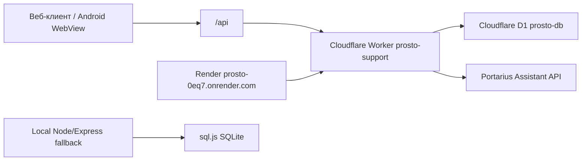

# Проект «Просто»: техническое описание и handoff

Актуально на: 03.08.2026  
Репозиторий: https://github.com/khorvatvv-cmyk/Prosto  
Рабочая папка: `C:\Users\user\Desktop\Вайб\prosto-main-fix`  
Текущая ветка: `main`  
Последний проверенный коммит: `1459419 fix: make admin staff workspaces reliably accessible`

## 1. Что это за приложение

«Просто» - приложение для клиентской поддержки по 1С и работы команды сопровождения.

В системе есть:

- клиентский кабинет: регистрация, профиль организации, создание вопросов, диалог с ИИ, передача в L1, оценка решения, важные уведомления и чат с менеджером;
- АРМ специалиста L1: очередь обращений, взятие в работу, ответы клиенту, внутренние заметки, запрос данных, готовое решение, передача менеджеру;
- АРМ менеджера: клиенты/организации, статусы обслуживания, заявки на подтверждение пользователей, задачи, чат с клиентами, кампании/акции;
- АРМ РОФ: общая сводка, менеджеры, клиенты, назначение/снятие менеджеров, очередь L1, кампании;
- админ-панель: здоровье сервера, пользователи, организации, обращения, сообщения, тест ассистента, создание специалиста/менеджера/РОФ, смена ролей, быстрый вход в рабочие места;
- Android APK для клиентов на базе Capacitor.

## 2. Архитектура



Основной production сейчас - Cloudflare Worker:

- frontend собирается Vite и публикуется как Worker assets;
- API живет в `worker/index.js`;
- постоянная база - Cloudflare D1 `prosto-db`;
- секреты хранятся в Cloudflare Worker Secrets;
- ассистент подключается через Portarius Assistant API.

Render оставлен как резервный/legacy web service. В `render.yaml` frontend на Render специально получает `VITE_API_URL=https://prosto-support.bit-support.workers.dev/api`, то есть даже при открытии Render-ссылки пользователь работает с Cloudflare API и D1.

## 3. Продакшен-ссылки и сервисы

Основная ссылка:

- https://prosto-support.bit-support.workers.dev

Основной API:

- https://prosto-support.bit-support.workers.dev/api

Health-check Cloudflare, проверено 03.08.2026:

```json
{"status":"ok","platform":"cloudflare-workers","assistant":"configured","database":"ok"}
```

Render-ссылка:

- https://prosto-0eq7.onrender.com

Render service id:

- `srv-d9ms8a3ncjis7390ve00`

Render health-check, проверено 03.08.2026:

```json
{"status":"ok","assistant":"configured","database":"ok"}
```

Важно: Render живой, но каноническая база и основной API - Cloudflare.

## 4. Технологии

Frontend:

- React 19;
- Vite 8;
- Tailwind CSS 4 через `@tailwindcss/vite`;
- `motion` для анимаций;
- `lucide-react` для иконок;
- брендовый цвет: `#E50071`.

Backend production:

- Cloudflare Workers;
- Cloudflare D1;
- Web Crypto API для JWT и хеширования паролей;
- Worker assets для SPA.

Backend local/Render fallback:

- Node.js 22;
- Express;
- `sql.js`;
- `bcryptjs`;
- `jsonwebtoken`.

Android:

- Capacitor 8;
- package/application id: `ru.firstbit.prosto`;
- min SDK 24;
- target/compile SDK 36;
- debug APK, versionCode `1`, versionName `1.0`.

## 5. Где что лежит

Основные файлы:

- `src/main.jsx` - точка входа React.
- `src/App.jsx` - главный роутинг SPA, проверка ролей, подключение layout, toast, polling уведомлений.
- `src/api.js` - клиент API. На Render принудительно использует Cloudflare API, локально и на Worker использует `/api`.
- `src/access.js` - правила доступа по ролям и стартовые страницы.
- `src/index.css` - дизайн-система, переменные цветов, адаптивность, анимации.
- `src/components/ui/AceternityEffects.jsx` - адаптированные механики Aceternity UI.
- `worker/index.js` - основной production API.
- `worker/crypto.js` - JWT и хеширование паролей для Worker.
- `worker/assistant.js` - интеграция с Assistant API.
- `server/index.js` - Node/Express API для локального/Render режима.
- `server/db.js` - локальная SQLite-схема через sql.js.
- `server/assistant.js` - интеграция ассистента для Node API.
- `migrations/*.sql` - D1/SQLite миграции.
- `wrangler.jsonc` - Cloudflare Worker, assets и D1 binding.
- `render.yaml` - Render blueprint.
- `capacitor.config.json` - Capacitor-конфиг Android.
- `ANDROID.md` - краткая инструкция сборки APK.
- `artifacts/Prosto-client-1.0.0.apk` - готовый debug APK для установки вручную.

## 6. Роли и доступ

Роли:

- `user` - клиент;
- `specialist` - специалист L1;
- `manager` - менеджер сопровождения;
- `rof` - руководитель офиса/РОФ;
- `admin` - администратор.

Разрешенные страницы заданы в `src/access.js`:

- клиент: `dashboard`, `new`, `detail`, `important`, `notifs`, `manager-chat`, `profile`;
- менеджер: `manager`, `profile`;
- специалист: `specialist`, `profile`;
- РОФ: `rof`, `profile`;
- админ: клиентские экраны, `admin`, `specialist`, `manager`, `rof`.

Недавнее исправление: из администратора доступны АРМ РОФ, АРМ менеджера и АРМ специалиста. Это покрыто тестом `src/access.test.js`.

## 7. Функционал по экранам

Клиентский кабинет:

- регистрация и вход;
- заполнение профиля: ИНН, организация, вид деятельности, продукт 1С, версия, тип конфигурации, доработки;
- главная сводка обращений: открыто, решено, всего;
- фильтры обращений: все, открытые, решенные;
- создание обращения;
- диалог по обращению;
- автоматический первый ответ ассистента;
- передача вопроса в L1, если ответ не помог;
- подтверждение или отклонение готового решения;
- чат с менеджером;
- уведомления;
- раздел «Важное для вас» с доставленными акциями/кампаниями.

АРМ специалиста:

- общая очередь L1;
- фильтры очереди: ожидает, в работе, нужны данные, готово, возвращено;
- список «Мои обращения»;
- поиск по обращениям;
- карточка обращения с компактным timeline;
- взять обращение в работу;
- освободить обращение;
- отправить сообщение клиенту;
- добавить внутреннюю заметку;
- запросить дополнительные данные;
- отправить готовое решение;
- передать менеджеру с причиной, диагнозом, ожидаемым результатом и приоритетом;
- просмотр клиентского чата по пользователю.

АРМ менеджера:

- dashboard с метриками;
- список клиентов: мои, без менеджера, все;
- карточка организации;
- пользователи организации и подтверждение/отклонение pending-пользователей;
- обращения организации;
- задачи менеджера;
- изменение статуса обслуживания;
- чат с клиентами;
- создание нового чата с клиентом;
- кампании/акции;
- точечный запуск кампании по выбранным организациям;
- запуск по всем своим клиентам;
- просмотр доставок кампаний.

АРМ РОФ:

- сводка по организациям, менеджерам, очереди L1 и задачам;
- список менеджеров;
- список клиентов;
- поиск клиентов;
- назначение менеджера на организацию;
- снятие менеджера;
- очередь L1 по офису/системе;
- создание и запуск кампаний на системную аудиторию.

Админ-панель:

- статус сервера, базы, ассистента и uptime;
- список пользователей;
- смена роли пользователя;
- создание специалиста, менеджера и РОФ;
- отдельный перевод существующего пользователя в РОФ;
- список обращений;
- просмотр сообщений обращения;
- список организаций;
- тест ассистента;
- быстрые кнопки открытия АРМ специалиста, менеджера и РОФ.

## 8. Клиентский путь

1. Клиент регистрируется или входит.
2. Если профиль неполный, приложение показывает onboarding-профиль.
3. Клиент создает вопрос по 1С.
4. Обращение создается в базе, затем запрашивается L0-ответ ассистента.
5. Клиент читает ответ.
6. Если ответ помог, клиент подтверждает решение, обращение закрывается.
7. Если ответ не помог, обращение переводится в L1 со статусом `waiting`.
8. Специалист берет обращение, ведет переписку, запрашивает данные или готовит решение.
9. Клиент подтверждает решение или возвращает обращение в работу.
10. Менеджер может отдельно общаться с клиентом в менеджерском чате и отправлять акции в «Важное для вас».

## 9. Данные и база

Основные таблицы:

- `users` - пользователи, роли, профиль клиента и данные 1С;
- `requests` - обращения, статусы, уровень L0/L1, назначенный специалист, организация, результат;
- `messages` - сообщения по обращениям, включая внутренние заметки;
- `offices` - офисы;
- `organizations` - организации по ИНН, менеджер, статус обслуживания;
- `organization_users` - связь пользователей с организациями и статус membership;
- `client_assignments` - история назначений менеджеров;
- `manager_conversations` - чаты клиент-менеджер;
- `manager_messages` - сообщения менеджерского чата;
- `campaigns` - кампании/акции;
- `campaign_targets` - точечные цели кампаний;
- `campaign_deliveries` - доставки кампаний пользователям;
- `manager_tasks` - задачи менеджеров;
- `audit_log` - аудит действий.

Миграции:

- `0001_init.sql` - пользователи, обращения, сообщения;
- `0002_user_profile.sql` - поля профиля клиента;
- `0003_l1_workflow.sql` - L1 workflow;
- `0004_manager_rof.sql` - организации, менеджеры, РОФ, кампании, задачи, аудит;
- `0005_migrate_data.sql` - перенос старых пользователей/обращений в организации;
- `0006_campaign_audience.sql` - точечные аудитории кампаний и защита от повторной доставки.

## 10. API

Публичные/auth endpoints:

- `GET /api/health`;
- `POST /api/auth/register`;
- `POST /api/auth/login`;
- `GET /api/auth/me`;
- `PUT /api/profile`.

Клиентские обращения:

- `GET /api/requests`;
- `POST /api/requests`;
- `GET /api/requests/:id`;
- `POST /api/requests/:id/messages`;
- `POST /api/requests/:id/assistant`;
- `POST /api/requests/:id/evaluate`;
- `POST /api/manager/messages`.

Админ:

- `GET /api/admin/stats`;
- `GET /api/admin/users`;
- `GET /api/admin/requests`;
- `GET /api/admin/organizations`;
- `GET|POST /api/admin/requests/:id/messages`;
- `PATCH /api/admin/requests/:id`;
- `PATCH /api/admin/users/:id/role`;
- `POST /api/admin/requests/:id/assign`;
- `POST /api/admin/specialists`;
- `POST /api/admin/test-assistant`.

Специалист:

- `GET /api/specialist/queue`;
- `GET /api/specialist/my-requests`;
- `GET /api/specialist/requests/:id`;
- `POST /api/specialist/requests/:id/take`;
- `POST /api/specialist/requests/:id/release`;
- `POST /api/specialist/requests/:id/messages`;
- `POST /api/specialist/requests/:id/internal-note`;
- `POST /api/specialist/requests/:id/need-data`;
- `POST /api/specialist/requests/:id/result`;
- `POST /api/specialist/requests/:id/transfer-to-manager`;
- `GET /api/specialist/client-chat`.

Менеджер/РОФ:

- `GET /api/manager/dashboard`;
- `GET /api/manager/clients`;
- `GET /api/manager/orgs/:id`;
- `POST /api/manager/orgs/:id/assign`;
- `POST /api/manager/orgs/:id/unassign`;
- `POST /api/manager/orgs/:id/service-status`;
- `GET /api/manager/pending-users`;
- `POST /api/manager/approve-user`;
- `GET /api/manager/tasks`;
- `POST /api/manager/tasks/:id`;
- `GET /api/rof/dashboard`;
- `GET /api/rof/clients`;
- `GET /api/rof/l1-queue`.

Чаты, уведомления, кампании:

- `GET /api/chat/list`;
- `GET /api/chat/:id/messages`;
- `POST /api/chat/send`;
- `GET /api/notifications`;
- `GET /api/campaigns`;
- `POST /api/campaigns`;
- `POST /api/campaigns/:id/activate`;
- `GET /api/campaigns/:id/deliveries`;
- `GET /api/feed`;
- `POST /api/feed/:deliveryId/action`.

## 11. Ассистент

Интеграция находится в:

- `worker/assistant.js`;
- `server/assistant.js`.

Используются переменные:

- `ASSISTANT_BASE_URL=https://portarius.1bitai.ru`;
- `ASSISTANT_ID`;
- `ASSISTANT_API_KEY`.

Health-check показывает `assistant: "configured"`, если ID и ключ заданы. Ключ, который когда-то был отправлен в чат, надо считать раскрытым и заменить в Cloudflare/Render на новый. В код и Git реальные ключи не добавлять.

## 12. Логины, пароли и секреты

Реальные пароли и API-ключи не должны храниться в репозитории и не должны попадать в этот handoff-файл.

Где находятся секреты:

- Cloudflare Dashboard -> Workers & Pages -> `prosto-support` -> Settings -> Variables and Secrets;
- Render Dashboard -> service `srv-d9ms8a3ncjis7390ve00` -> Environment;
- локальная разработка: `.dev.vars` для Worker и `.env`/переменные окружения для Node, эти файлы не коммитить.

Нужные секреты:

- `JWT_SECRET` - подпись JWT;
- `PASSWORD_PEPPER` - pepper для HMAC-хешей паролей в Worker;
- `ASSISTANT_ID` - ID ассистента;
- `ASSISTANT_API_KEY` - ключ ассистента;
- `ASSISTANT_BASE_URL` - URL Portarius Assistant API;
- `ADMIN_EMAIL` - email администратора;
- `ADMIN_PASSWORD` - пароль для автосоздания админа, минимум 12 символов.

Как работает админ:

- если пользователь регистрируется с email, совпадающим с `ADMIN_EMAIL`, он получает роль `admin`;
- при логине Worker может автосоздать администратора, если заданы `ADMIN_EMAIL` и `ADMIN_PASSWORD` длиной не меньше 12 символов;
- если admin уже существует, совпадение email с `ADMIN_EMAIL` поднимает роль до `admin`.

Тестовые логины из автотестов, не production:

- `admin@example.test` / `admin-password-2026`;
- `user@example.test` создается внутри тестов.

Передача реальных логинов/паролей разработчикам должна идти через менеджер паролей или защищенный канал. В репозитории можно хранить только шаблоны `.env.example` и `.dev.vars.example`.

## 13. Android APK

Android-приложение - это Capacitor-оболочка вокруг того же React-интерфейса. Отдельной нативной бизнес-логики нет: авторизация, обращения, чат, важные уведомления и профиль работают через production API Cloudflare.

Конфиг:

- `capacitor.config.json`;
- `appId`: `ru.firstbit.prosto`;
- `appName`: `Просто`;
- `webDir`: `dist`;
- Android scheme: `https`.

Готовый APK:

- `artifacts/Prosto-client-1.0.0.apk`;
- размер: 4 574 331 байт;
- SHA256: `9CEC2C8C4D396C68E24FE5C1034F1437FF21D549DE188BDE459CDA8ED0FC1847`;
- тип: debug APK;
- версия: `1.0`;
- минимальный Android: API 24 / Android 7.0.

Сборка:

```powershell
npm ci
npm run android:apk
```

Команда делает:

- `vite build --mode android`;
- удаление скачиваемого APK из Android-бандла через `vite.config.js`;
- `cap sync android`;
- `android\gradlew.bat assembleDebug`.

Выходной файл Gradle:

- `android/app/build/outputs/apk/debug/app-debug.apk`.

Копия для передачи:

- `artifacts/Prosto-client-1.0.0.apk`.

Ограничения APK:

- подписан debug-сертификатом;
- подходит для ручной установки и тестов;
- для Google Play нужен release key и сборка release/AAB;
- секреты в APK не встраиваются;
- API задается через `.env.android`, сейчас `https://prosto-support.bit-support.workers.dev/api`.

## 14. Интерфейс и эффекты Aceternity UI

В проект добавлены адаптированные механики Aceternity UI, без переноса темных фонов и демо-дизайна:

- свечение за курсором в рабочей области;
- подсветка границ карточек;
- spotlight внутри важных карточек;
- плавная hover-подложка в списках;
- подсветка основных кнопок;
- stateful button для действий;
- animated tabs;
- маленькие animated tooltips;
- компактный timeline обращения;
- временная moving border для новых событий;
- мягкий background gradient для важных блоков;
- cycling placeholders для поиска/ввода.

Код:

- `src/components/ui/AceternityEffects.jsx`;
- CSS: `src/index.css`.

Эффекты отключаются на мобильных/сенсорных устройствах и при `prefers-reduced-motion`.

## 15. Команды разработки

Установка:

```powershell
npm ci
npm --prefix server ci
```

Локальный frontend:

```powershell
npm run dev
```

Локальный Node API + собранный frontend:

```powershell
npm run build
npm start
```

Cloudflare local:

```powershell
npm run build
npm run cf:migrate:local
npm run cf:dev
```

Cloudflare deploy:

```powershell
npm run cf:migrate:remote
npm run cf:deploy
```

Android:

```powershell
npm run android:apk
```

Проверки:

```powershell
npm run lint
npm run build
npm test
npm run test:worker
npm run test:access
```

## 16. Что проверено

Последняя полная проверка после исправления доступа администратора:

- `npm run lint`;
- `npm run build`;
- frontend/access tests;
- worker tests;
- server tests.

03.08.2026 дополнительно проверены публичные health endpoints Cloudflare и Render.

## 17. Что важно не сломать

- `src/api.js`: Render должен ходить в Cloudflare API, иначе данные разъедутся.
- `src/access.js`: админ должен иметь доступ к `specialist`, `manager`, `rof`.
- `worker/index.js`: production-логика полнее, чем Node fallback; новые функции сначала добавлять туда.
- Миграции D1 должны идти через `wrangler d1 migrations apply`.
- Реальные секреты не коммитить.
- APK после изменения frontend/API надо пересобирать.

## 18. Ближайшие технические долги

- Сделать release-сборку Android с нормальным signing key/AAB.
- Добавить автоматическую CI-проверку lint/build/tests.
- Добавить страницу/инструкцию безопасной ротации секретов.
- Добавить monitoring/uptime checker для Cloudflare и Render.
- Уточнить продуктовые границы РОФ: какие действия он может делать как руководитель, а какие как менеджер верхнего уровня.
- Добавить экспорт обращений/организаций для админа и РОФ.

